# AI 3D Avatar Stress Test

This repository contains the setup, prompt, and generated outputs from a small experiment comparing three AI models asked to create the same animated 3D human avatar in Blender.

The same cleaned prompt was used for each run. See [`Prompt.md`](Prompt.md). The external reference material used during the private tests is documented in [`references.md`](references.md), but those files are not redistributed here.

The polished write-up is available at [Testing Astra, Luna, and Qwen in Blender](https://robertoguarneros.dev/blog/testingastralunaqwen3d/).

## Experiment design

Each model was asked to create a full-body, gender-neutral fitness avatar with:

- A complete deformable body rig
- Independently controllable fingers and thumbs
- A `Wrist_Finger_Stretch` animation from frames 1–120
- Resting-pose and stretching-pose renders
- A close-up wrist and hand render
- An animated preview when practical
- An editable Blender source file

The models were given the same task and allowed to make reasonable implementation decisions. The comparison is qualitative rather than a scientific benchmark; the goal was to observe spatial reasoning, organic modeling, rigging, hand anatomy, animation, and error correction in a real Blender workflow.

| Model | Harness | Result time | Summary |
| --- | --- | ---: | --- |
| Qwen3.8 27B GGUF UD-Q4_K_XL | llama.cpp + OpenCode | about 4 h 40 min | Completed the task, but struggled with clothing and detail cleanup. |
| Luna | Codex | 15 min 11 s | Produced clearer modeling and better motion, but the body became very rounded and stylized. |
| Astra | Codex | about 36 min | Produced the strongest overall result and required less visible correction. |

## Test machine and software

### Hardware

- CPU: Intel Core i9-14900K
- Memory: 32 GB RAM
- GPU: AMD Radeon RX 7900 XTX

### Operating system

The tests were run on Kali Linux because it was the available Linux environment. Ubuntu may require less manual configuration, but it was not used for these runs.

### Software

- Blender 5.2.1 LTS
- Codex build 26.903.71938
- OpenCode for the local Qwen run
- llama.cpp with the Vulkan backend for local inference
- Official Blender MCP add-on and server from Blender Lab

## Setup

The commands below document the environment used for the experiment. Paths are examples from the original Linux machine; replace `/home/roberto` with your own home directory where necessary.

### Blender and the official MCP add-on

1. Install Blender 5.2.1 LTS.
2. Download the official Blender MCP add-on from the [Blender MCP server page](https://www.blender.org/lab/mcp-server/).
3. In Blender, open **Edit → Preferences → Extensions**.
4. Choose **Install from Disk**, select the downloaded add-on, and accept the default repository and enable settings.

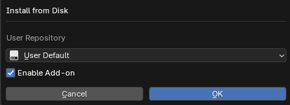

5. Restart Blender.
6. Open **Preferences → System** and enable **Allow Online Access**.

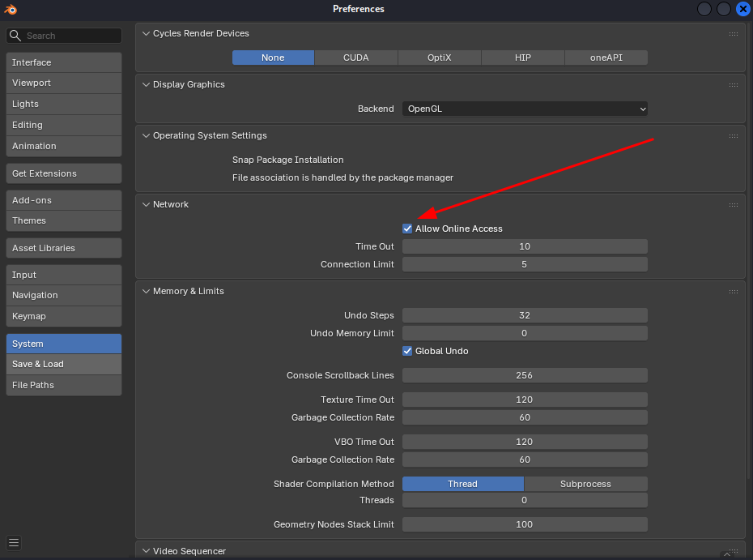

7. In the extensions/add-ons list, confirm that **MCP** is enabled.

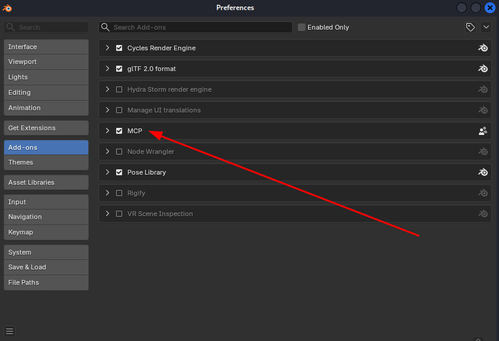

8. Open the MCP settings and keep the default host and port: `localhost:9876`.
9. Keep **Auto Start** enabled and start the **MCP Bridge Server**.

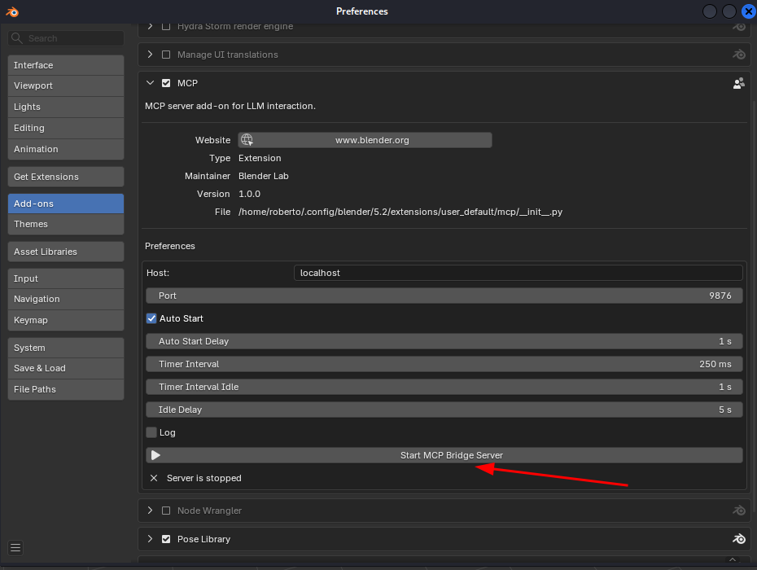

When the bridge is running, Blender should show the server status as running.

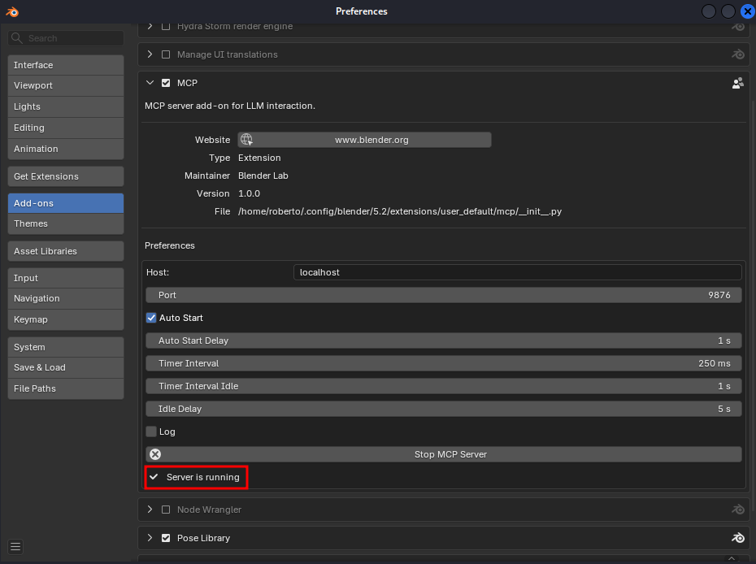

The bridge must be running in Blender before the LLM-side MCP server can connect to it.

### Official Blender MCP server

The MCP server used in this experiment is the official implementation from [Blender Lab](https://projects.blender.org/lab/blender_mcp). The complete setup instructions are available in the [official Setup wiki](https://projects.blender.org/lab/blender_mcp/wiki/Setup).

#### Install `uv`

On Debian-based Linux systems:

```bash
sudo apt update
sudo apt install -y curl
curl -LsSf https://astral.sh/uv/install.sh | sh
```

#### Clone the server

```bash
git clone https://projects.blender.org/lab/blender_mcp.git ~/blender_mcp
```

#### Configure Codex

Add the following entry to `~/.codex/config.toml`. Replace the paths if the repository or `uv` is installed elsewhere.

```toml
[mcp_servers.blender]
command = "/home/roberto/.local/bin/uv"
args = ["--directory", "/home/roberto/blender_mcp/mcp", "run", "blender-mcp"]

[mcp_servers.blender.tools.execute_blender_code]
approval_mode = "approve"
```

Restart Codex after changing the configuration.

### llama.cpp and Qwen

The Qwen run used a local llama.cpp server. Installation details vary depending on the GPU backend, so only the run configuration is recorded here:

```bash
./build/bin/llama-server \
  -hf unsloth/Qwen3.8-27B-GGUF:UD-Q4_K_XL \
  --alias qwen-local \
  --device Vulkan0 \
  --host 127.0.0.1 \
  --port 8080 \
  -ngl 999 \
  -c 131072 \
  --parallel 1 \
  -fa on \
  -ctk q8_0 \
  -ctv q8_0
```

Add this provider to `~/.codex/config.toml`:

```toml
[model_providers.llamacpp]
name = "llama.cpp"
base_url = "http://127.0.0.1:8080/v1"
wire_api = "responses"
requires_openai_auth = false
```

For a local Codex run, select the provider and model:

```toml
model_provider = "llamacpp"
model = "qwen-local"
```

### OpenCode

The Qwen run used OpenCode because the local non-native model was not working reliably through the Codex MCP configuration at the time of the test.

Add the following to `~/.config/opencode/opencode.jsonc`:

```jsonc
{
  "$schema": "https://opencode.ai/config.json",
  "model": "llama.cpp/qwen-local",
  "provider": {
    "llama.cpp": {
      "npm": "@ai-sdk/openai-compatible",
      "name": "llama.cpp local",
      "options": {
        "baseURL": "http://127.0.0.1:8080/v1"
      },
      "models": {
        "qwen-local": {
          "name": "Qwen3.8 27B Q4 Local",
          "limit": {
            "context": 131072,
            "output": 32768
          }
        }
      }
    }
  },
  "mcp": {
    "blender": {
      "type": "local",
      "command": [
        "/home/roberto/.local/bin/uv",
        "--directory",
        "/home/roberto/blender_mcp/mcp",
        "run",
        "blender-mcp"
      ]
    }
  }
}
```

Keep Blender open with the MCP bridge running before starting the Codex or OpenCode session.

## Results

The final renders, videos, and Blender files are organized by model:

- [`output_astra/`](output_astra/)
- [`output_luna/`](output_luna/)
- [`output_qwen/`](output_qwen/)

### Astra

Astra produced the strongest overall result. The hand pose was clear, the fingers were separated more successfully, and the animation communicated the intended stretch. The source file was saved by the model as `stretch_avatar_Aster.blend`.

| Rest pose | Stretch pose | Wrist close-up |
| --- | --- | --- |
| 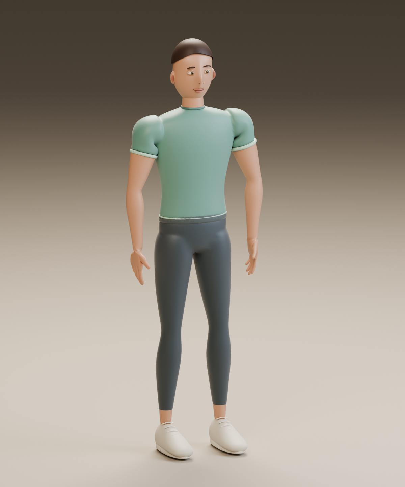 | 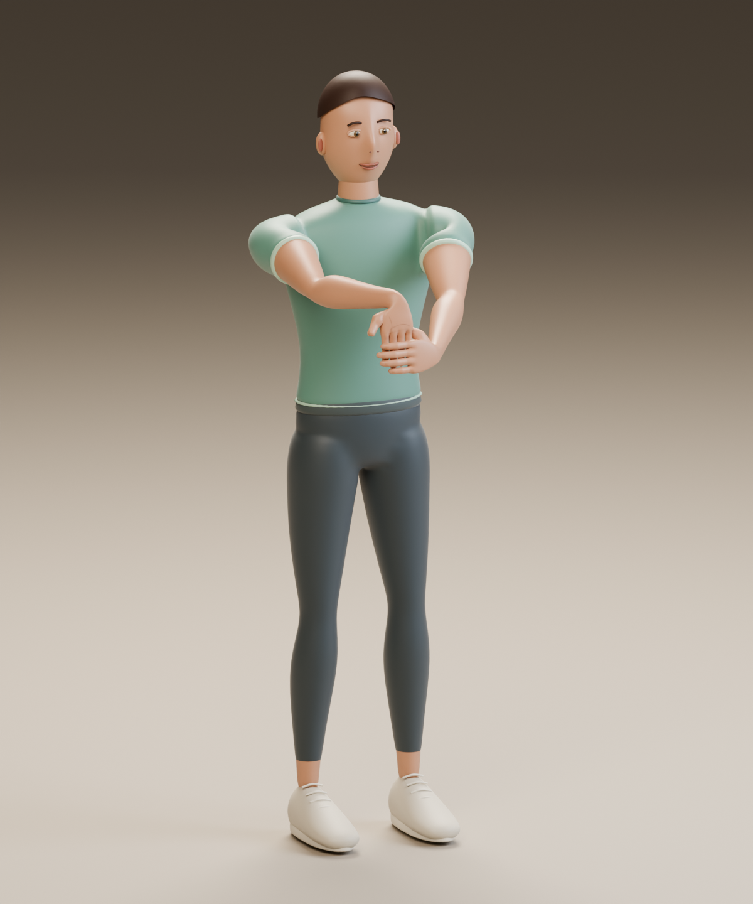 | 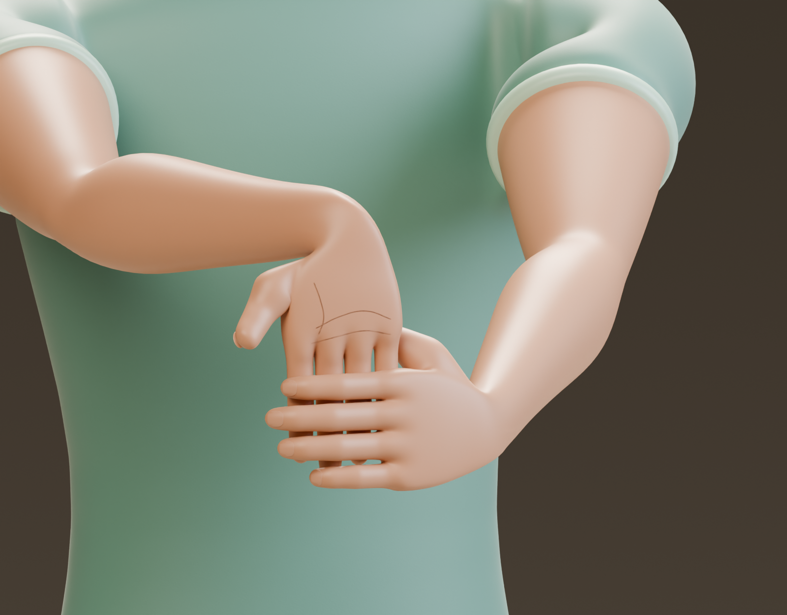 |

[Watch the Astra animation](output_astra/wrist_finger_stretch.mp4) · [Open the Blender source](output_astra/stretch_avatar_Aster.blend)

### Luna

Luna produced better-than-expected motion and a coherent avatar, but the character became noticeably bubbly and unreal. Its animation preview was assembled from rendered frames after the initial run with a second prompt since it was not produced on the first one.

| Rest pose | Stretch pose | Wrist close-up |
| --- | --- | --- |
| 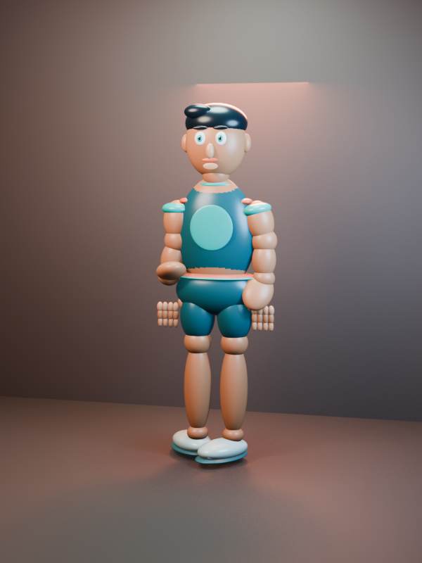 | 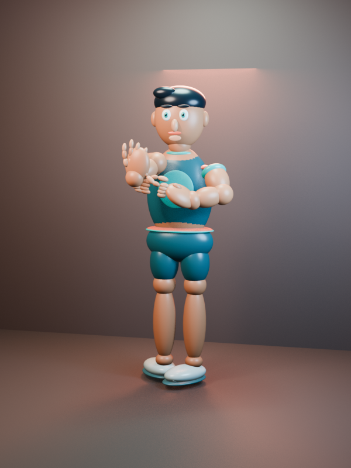 | 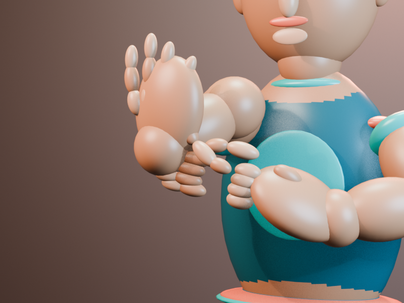 |

[Watch the Luna animation](output_luna/wrist_finger_stretch.mp4) · [Open the Blender source](output_luna/stretch_avatar_Luna.blend)

### Qwen

Qwen completed the task after a much longer local run. It created the rig and animation, but struggled more with hands, clothing, hair, and other modeling details.

| Rest pose | Stretch pose | Wrist close-up |
| --- | --- | --- |
| 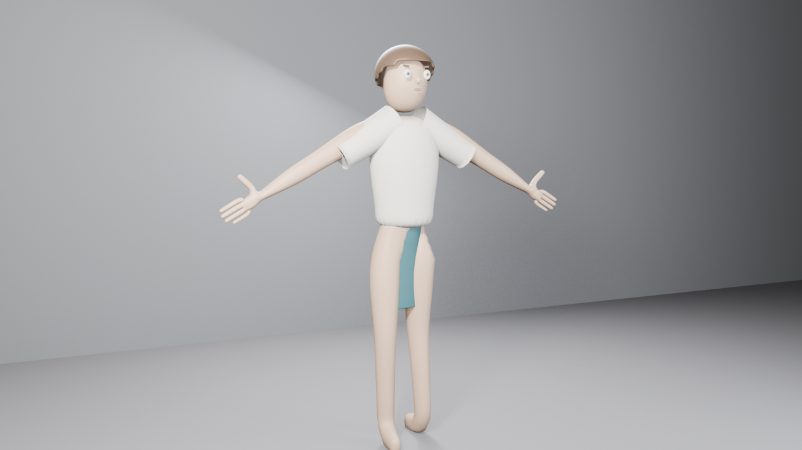 | 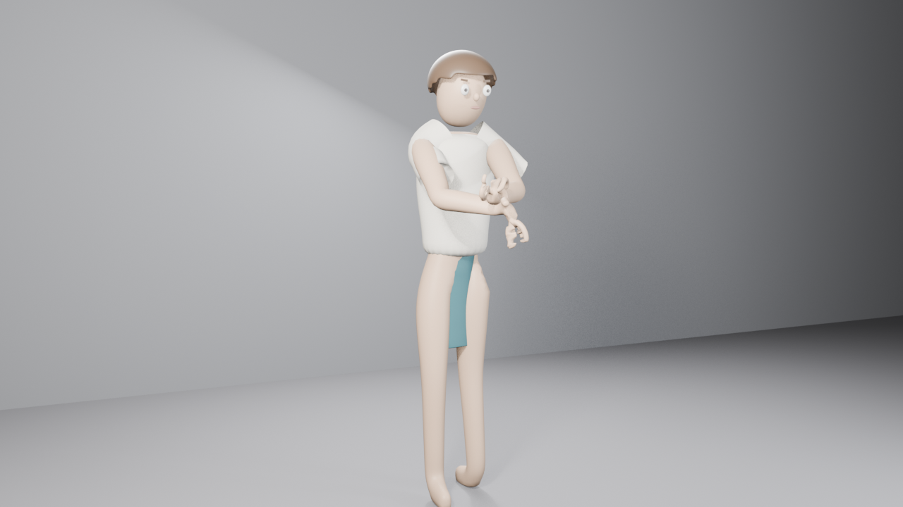 | 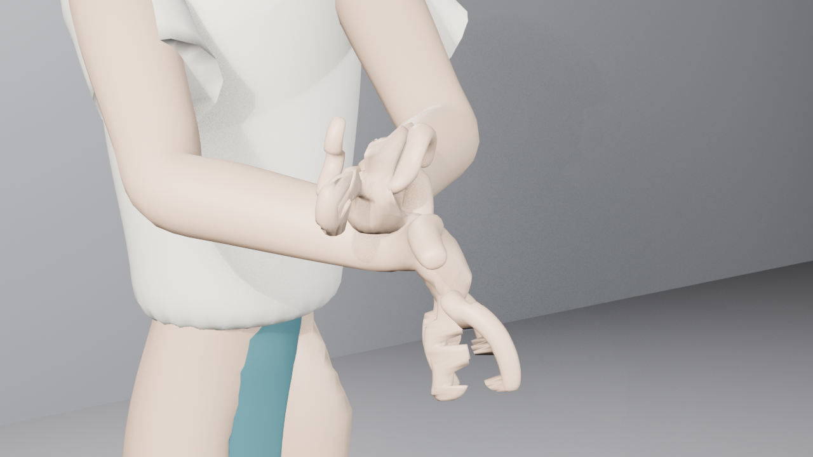 |

[Watch the Qwen animation](output_qwen/wrist_finger_stretch.mp4) · [Open the Blender source](output_qwen/stretch_avatar.blend)

## Verification notes

The Astra run included a 120-frame verification pass:

- Action: `Wrist_Finger_Stretch`
- Rest and stretch holds: exact
- Return to rest: verified
- Feet stationary: verified
- Unweighted vertices: 0
- Non-normalized vertices: 0
- Bones: 61, including 30 finger/thumb bones
- Video: 120 decoded frames at 24 fps, five seconds total

## Publication notes

The external reference images remain local-only. Their source pages and direct download links are documented in [`references.md`](references.md), but the files are not included in this repository.

The generated avatar was requested as an original design and should not reproduce Wii Fit branding, textures, the original character, or other third-party game assets.
